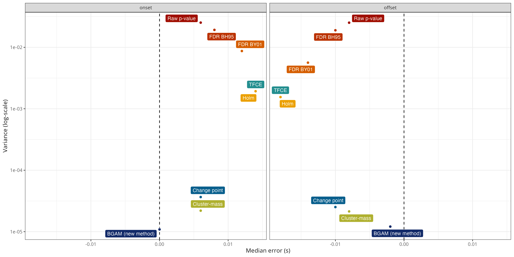

# Precise temporal localisation of M/EEG effects with Bayesian generalised additive multilevel models

## Abstract

Time-resolved electrophysiological measurements such as those obtained through magneto- or electro-encephalography (M/EEG) offer a unique window into the neural activity underlying cognitive processes. Researchers are often interested in determining whether and when these signals differ across experimental conditions or participant groups. The conventional approach involves mass-univariate statistical testing across time, followed by corrections for multiple comparisons (e.g., FDR, FWER) or cluster-based inference. While effective for controlling error rates, cluster-based methods come with a significant limitation: they shift the focus of inference from individual time points to clusters, making it difficult to draw precise conclusions about the onset or offset of observed effects. Here, we introduce a *model-based* approch for analysing M/EEG timeseries such as event-related potentials (ERPs) or decoding performance over time. Our method leverages Bayesian generalised additive multilevel models (GAMMs), providing posterior probabilities that an effect is above zero (or above chance) at each time point, while naturally accounting for temporal dependencies and between-subject variability. Using both simulated and actual M/EEG datasets, we demonstrate that this approach substantially outperforms conventional methods in estimating the onset and offset of neural effects, yielding more precise and reliable results. We also provide an R package implementing the method and show how it can be seamlessly integrated into M/EEG analysis pipelines using MNE-Python.

## Main simulation results

The figure below shows a summary of the simulation results, revealing that the proposed approach (`BGAM`) has the lowest median error and variance for both the onset and offset estimates.

## Application to actual MEG data (time-resolved decoding)

The figure below shows the group-level average decoding performance through time with onset and offset estimates for each method. Overall, this figure shows that the `Raw p-value` method is extremely lenient, considering that decoding performance is above chance before the onset of the stimulus (false positive) and until the end of the trial. The `Change point`, `TFCE`, and `Holm` methods are the most conservative methods, identifying a time window from approximately +60ms to +550ms. The `FDR BH95`, `FDR BY01`, `Cluster mass`, and `BGAM` methods produced somewhat similar estimates of onset and offset, from approximately +60ms to +650ms.

