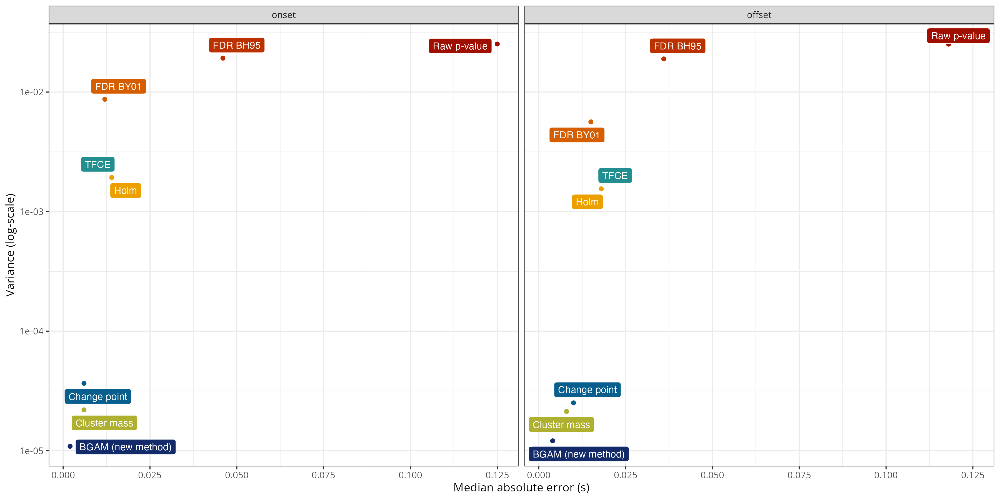
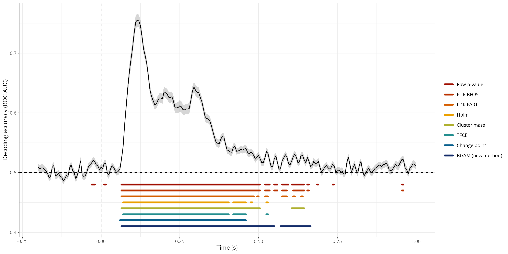

# Precise temporal localisation of M/EEG effects with Bayesian generalised additive multilevel models

## Abstract

Time-resolved electrophysiological measurements such as those offered by magneto- or electro-encephalography (M/EEG) provide a unique window onto neural activity underlying cognitive processes. Typically, researchers are interested in testing whether and when such measures differ across conditions and/or groups. The conventional approach consists in conducting mass-univariate statistics through time followed by some form of multiplicity correction (e.g., FDR, FWER) or cluster-based inference. However, while allowing efficient error-rates control, cluster-based methods have an important downside: they shift the focus of inference from the timepoint to the cluster level, thus preventing any conclusion to be made about the precise onset or offset of effects (e.g., differences across conditions or groups). Here, we introduce a *model-based* approch for analysing M/EEG timeseriesn such as ERPs or decoding performance through time, and their differences across conditions or groups. This approach relies on Bayesian generalised additive multilevel models and outputs the posterior probabilility of the effect being above 0 (or above chance) at every timestep, while naturally taking into account the temporal dependencies and between-subject variability present in such data. Using both simulated and actual M/EEG data, we show that the proposed approach largely outperforms conventional methods in estimating the onset and offset of M/EEG effects, producing *more precise* and *more reliable* estimates. We provide an R package implementing the approach and illustrate how to integrate it into M/EEG statistical pipelines in MNE-Python.

## Main simulation results

The figure below shows a summary of the simulation results, revealing that the proposed approach (`brms`) has the lowest MAE and variance for both the onset and offset estimates.

## Application to actual MEG data (time-resolved decoding)

The figure belows shows the group-level average decoding performance through time with onset and offset estimates for each method. The `brms_full` method is similar to the `brms` method except that the ROPE is defined on the entire dataset rather than on the split dataset. Overall, this figure shows that both the `Raw p-value` and `FDR BH95` methods were extremely lenient, considering that the decoding performance was above chance before the onset of the stimulus (false positive) and until the end of the trial. The `Change point` and `Cluster mass` methods were the most conservative methods, identifying a time window from approximately +60ms to +500ms. The `Holm`, `TFCE`, `brms`, and `brms_full` methods produced somewhat similar estimates of onset and offset, from approximately +60ms to +650ms.

