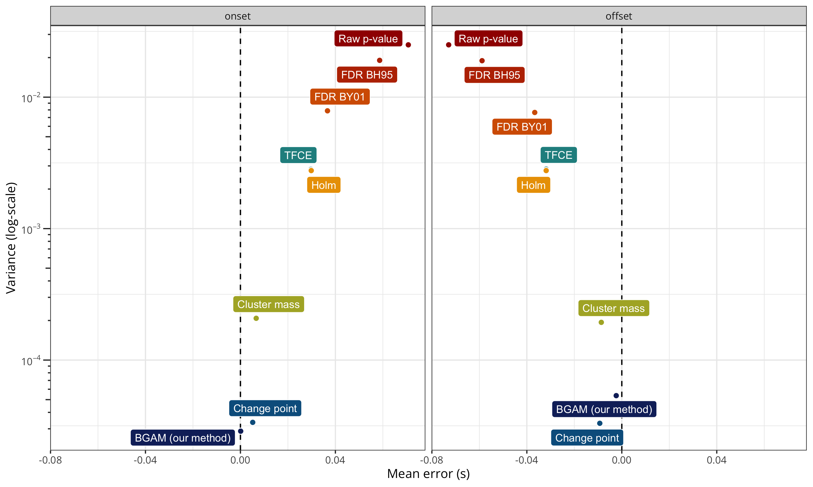
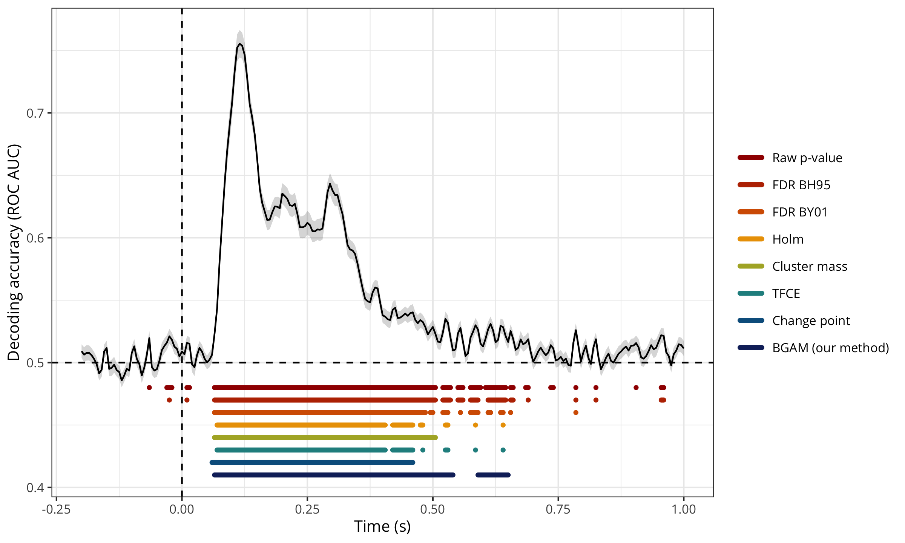

# Precise temporal localisation of M/EEG effects with Bayesian generalised additive multilevel models

## Abstract

Time-resolved electrophysiological measurements such as those obtained through magneto- or electro-encephalography (M/EEG) offer a unique window into the neural activity underlying cognitive processes. Researchers are often interested in determining whether and when these signals differ across experimental conditions or participant groups. The conventional approach involves mass-univariate statistical testing across time and space, followed by corrections for multiple comparisons such as cluster-based inference. While effective for controlling error rates at the cluster-level, cluster-based inference comes with a significant limitation: by shifting the focus of inference from individual time points to clusters, it makes difficult to draw precise conclusions about the onset or offset of observed effects. Here, we introduce a *model-based* approach for analysing M/EEG timeseries such as event-related potentials (ERPs) or decoding performance over time. Our approach leverages Bayesian generalised additive multilevel models, providing posterior probabilities that an effect is above zero (or above chance) at each time point, while naturally accounting for temporal dependencies and between-subject variability. Using both simulated and actual M/EEG datasets, we demonstrate that this approach substantially outperforms conventional methods in estimating the onset and offset of neural effects, yielding more precise and reliable results. We provide an R package implementing the method and describe how it can be integrated into M/EEG analysis pipelines using MNE-Python.

## Main simulation results

The figure below shows a summary of the simulation results, revealing that the proposed approach (`BGAM`) has the lowest average error (bias) for both the onset and offset estimates.

## Application to actual MEG data (time-resolved decoding)

The figure below shows the group-level average decoding performance through time with onset and offset estimates for each method. Overall, this figure shows that both the `Raw p-value` and `FDR BH95` methods are extremely lenient, identifying clusters of above-chance decoding accuracy before the onset of the stimulus (false positive) and until the end of the trial. The `Holm`, `Cluster mass`, `TFCE`, and `BGAM` methods produce similar estimates of onset and offset, ranging from approximately +60ms to +650ms (considering only the first and last identified timesteps), although the `Cluster mass` and `BGAM` methods seems to result in fewer clusters.

## Usage

For users who are already familiar with `brms`, the recommended pipeline is to import ERPs or decoding results in `R` and analyse these data using the code provided in the main paper. However, it is also possible to call functions from the `neurogam R` package (available at <https://github.com/lnalborczyk/neurogam>), which come with sensible defaults.
